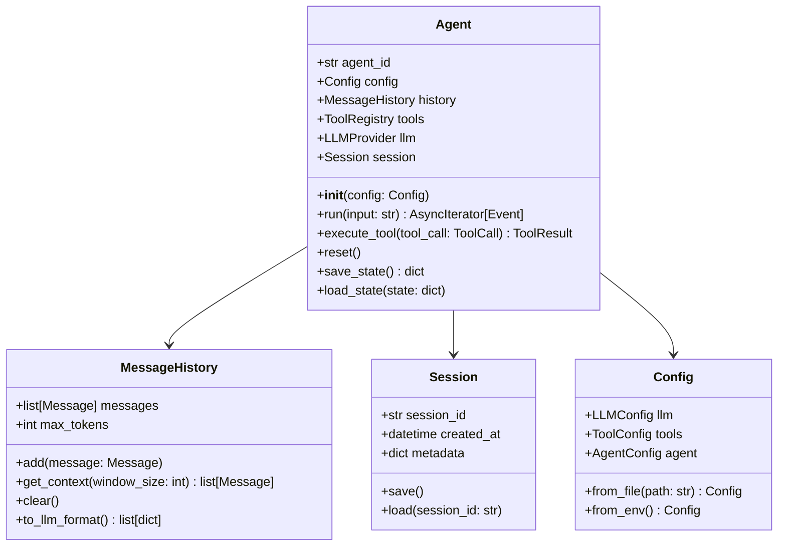
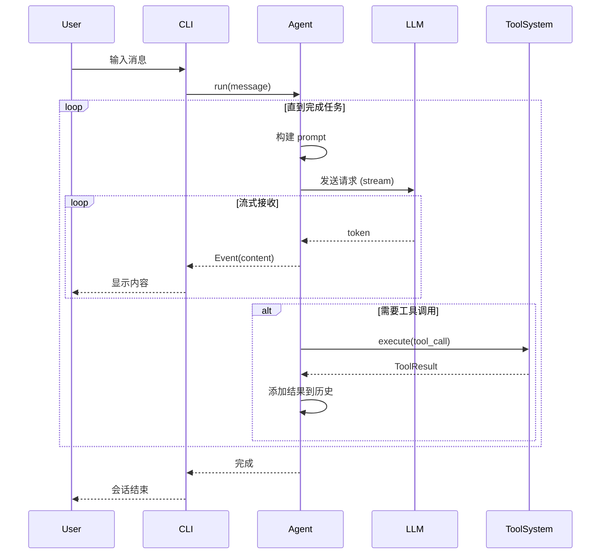

# Py Code Agent - 软件设计文档 (SDD)

## Software Design Document

**版本**: 1.0.0  
**日期**: 2025-01-19  
**作者**: AI Assistant  
**状态**: 草案

---

## 目录

1. [引言](#1-引言)
2. [系统架构概述](#2-系统架构概述)
3. [核心模块设计](#3-核心模块设计)
4. [接口设计](#4-接口设计)
5. [数据模型](#5-数据模型)
6. [扩展性设计](#6-扩展性设计)
7. [部署架构](#7-部署架构)
8. [附录](#8-附录)

---

## 1. 引言

### 1.1 目的

本文档描述 Py Code Agent 版本的软件架构和设计决策。Py Code Agent 是一个 AI 编程助手，旨在通过自然语言交互帮助开发者完成编程任务。

### 1.2 范围

本文档涵盖以下组件的设计：
- Agent Core (代理核心)
- CLI Interface (命令行界面)
- VS Code Extension (IDE 集成)
- Package Manager (包管理器)
- Tool System (工具系统)
- LLM Provider Interface (语言模型接口)

### 1.3 定义和缩略语

| 术语 | 定义 |
|------|------|
| Agent | 代理，指执行任务的 AI 实体 |
| CLI | Command Line Interface，命令行界面 |
| LLM | Large Language Model，大型语言模型 |
| TUI | Terminal User Interface，终端用户界面 |
| PTY | Pseudo Terminal，伪终端 |
| LSP | Language Server Protocol |
| REPL | Read-Eval-Print Loop |

### 1.4 参考资料

1. [Py Code Agent - VS Code Marketplace](https://marketplace.visualstudio.com/items?itemName=pi0.pi-vscode)
2. [Pi Coding Agent - GitHub](https://github.com/pi0/pi-vscode)
3. [Python asyncio Documentation](https://docs.python.org/3/library/asyncio.html)
4. [Rich Library Documentation](https://rich.readthedocs.io/)

---

## 2. 系统架构概述

### 2.1 系统上下文

```
┌─────────────────────────────────────────────────────────────────┐
│                        User / Developer                          │
└──────────────────────┬────────────────────────────────────────┘
                       │
       ┌───────────────┼───────────────┐
       │               │               │
       ▼               ▼               ▼
┌─────────────┐ ┌─────────────┐ ┌─────────────────┐
│    CLI      │ │ VS Code     │ │  Other IDEs     │
│  (Rich TUI) │ │ Extension   │ │  (via LSP)      │
└──────┬──────┘ └──────┬──────┘ └────────┬────────┘
       │               │                  │
       └───────────────┼──────────────────┘
                       │
                       ▼
           ┌─────────────────────┐
           │    Agent Core       │
           │  (Python/asyncio)   │
           └──────────┬──────────┘
                      │
       ┌──────────────┼──────────────┐
       │              │              │
       ▼              ▼              ▼
┌────────────┐ ┌────────────┐ ┌────────────┐
│  Tool      │ │  Package   │ │   LLM      │
│  System    │ │  Manager   │ │ Provider   │
└────────────┘ └────────────┘ └────────────┘
```

### 2.2 架构风格

采用 **分层架构** 结合 **插件架构**：

1. **表示层 (Presentation Layer)**
   - CLI (Rich TUI)
   - VS Code Extension
   - API Server (可选)

2. **业务逻辑层 (Business Logic Layer)**
   - Agent Core
   - Session Management
   - Tool Orchestration

3. **数据访问层 (Data Access Layer)**
   - LLM Provider Interface
   - Tool Registry
   - Package Registry

4. **插件层 (Plugin Layer)**
   - Tool Plugins
   - LLM Provider Plugins
   - Extension Plugins

### 2.3 技术栈

| 组件 | 技术 | 版本 |
|------|------|------|
| 语言 | Python | 3.10+ |
| 异步框架 | asyncio | 内置 |
| LLM 接入 | LiteLLM | latest |
| CLI UI | Rich + Textual | latest |
| HTTP 客户端 | httpx | latest |
| 配置管理 | Pydantic Settings | latest |
| 插件系统 | pluggy | latest |
| 测试 | pytest + pytest-asyncio | latest |

### 2.4 关键设计原则

1. **异步优先 (Async-First)**
   - 所有 I/O 操作使用 asyncio
   - 流式响应支持
   - 并发工具执行

2. **可扩展性 (Extensibility)**
   - 插件系统支持自定义工具
   - LLM Provider 可插拔
   - 配置驱动行为

3. **类型安全 (Type Safety)**
   - 完整的类型注解
   - Pydantic 模型验证
   - 静态类型检查

4. **开发者体验 (DX)**
   - 丰富的 CLI 界面
   - 清晰的错误信息
   - 详细的日志记录

---

## 3. 核心模块设计

### 3.1 Agent Core (代理核心)

#### 3.1.1 职责
- 管理对话状态和历史
- 协调工具执行
- 处理 LLM 交互
- 维护会话上下文

#### 3.1.2 类图



#### 3.1.3 时序图



### 3.2 CLI Interface (命令行界面)

#### 3.2.1 职责
- 提供交互式终端 UI
- 处理用户输入
- 显示流式响应
- 管理会话状态

#### 3.2.2 模块结构

```
py_code_agent/cli/
├── __init__.py
├── main.py          # CLI 入口
├── app.py           # 主应用逻辑
├── commands/        # 子命令
│   ├── __init__.py
│   ├── chat.py     # 聊天模式
│   ├── run.py      # 单次执行
│   ├── config.py   # 配置管理
│   └── package.py  # 包管理
├── ui/             # UI 组件
│   ├── __init__.py
│   ├── console.py  # 富文本控制台
│   ├── panels.py   # 面板组件
│   ├── progress.py # 进度显示
│   └── markdown.py # Markdown 渲染
└── styles/         # 样式定义
    ├── __init__.py
    └── theme.py
```

#### 3.2.3 UI 组件设计

```python
# py_code_agent/cli/ui/console.py

from rich.console import Console
from rich.live import Live
from rich.layout import Layout
from rich.panel import Panel
from typing import AsyncIterator

class AgentConsole:
    """富文本控制台，用于显示 Agent 交互"""
    
    def __init__(self):
        self.console = Console()
        self.layout = self._create_layout()
        self.live = Live(self.layout, console=self.console)
        
    def _create_layout(self) -> Layout:
        """创建布局"""
        layout = Layout()
        layout.split_column(
            Layout(name="header", size=3),
            Layout(name="main"),
            Layout(name="input", size=3)
        )
        layout["main"].split_row(
            Layout(name="chat"),
            Layout(name="sidebar", size=40)
        )
        return layout
    
    async def stream_response(
        self, 
        events: AsyncIterator[Event]
    ) -> None:
        """流式显示响应"""
        content = ""
        with self.live:
            async for event in events:
                if event.type == "content":
                    content += event.data
                    self.layout["chat"].update(
                        Panel(content, title="Chat")
                    )
                elif event.type == "tool_call":
                    self._show_tool_call(event.data)
                elif event.type == "tool_result":
                    self._show_tool_result(event.data)
                    
    def _show_tool_call(self, tool_call: ToolCall) -> None:
        """显示工具调用"""
        self.console.print(
            f"[dim]→ Calling {tool_call.name}[/dim]"
        )
        
    def _show_tool_result(self, result: ToolResult) -> None:
        """显示工具结果"""
        if result.success:
            self.console.print(
                f"[green]✓ {result.summary}[/green]"
            )
        else:
            self.console.print(
                f"[red]✗ {result.error}[/red]"
            )
```

### 3.3 Tool System (工具系统)

#### 3.3.1 职责
- 管理和注册可用工具
- 执行工具调用
- 处理工具结果
- 支持自定义工具扩展

#### 3.3.2 工具接口定义

```python
# py_code_agent/tools/base.py

from abc import ABC, abstractmethod
from typing import Any, Callable, Dict, List, Optional, Type
from pydantic import BaseModel, Field
from enum import Enum

class ToolParameterType(str, Enum):
    """参数类型"""
    STRING = "string"
    INTEGER = "integer"
    NUMBER = "number"
    BOOLEAN = "boolean"
    ARRAY = "array"
    OBJECT = "object"

class ToolParameter(BaseModel):
    """工具参数定义"""
    name: str
    type: ToolParameterType
    description: str
    required: bool = True
    default: Optional[Any] = None
    enum: Optional[List[Any]] = None

class ToolDefinition(BaseModel):
    """工具定义"""
    name: str
    description: str
    parameters: List[ToolParameter]
    returns: Optional[ToolParameter] = None
    examples: List[str] = Field(default_factory=list)

class ToolResult(BaseModel):
    """工具执行结果"""
    success: bool
    data: Optional[Any] = None
    error: Optional[str] = None
    summary: Optional[str] = None
    
    @classmethod
    def ok(cls, data: Any = None, summary: str = None) -> "ToolResult":
        return cls(success=True, data=data, summary=summary)
    
    @classmethod
    def fail(cls, error: str) -> "ToolResult":
        return cls(success=False, error=error)

class BaseTool(ABC):
    """工具基类"""
    
    @property
    @abstractmethod
    def definition(self) -> ToolDefinition:
        """返回工具定义"""
        pass
    
    @abstractmethod
    async def execute(self, **kwargs) -> ToolResult:
        """执行工具"""
        pass
    
    def validate_params(self, params: Dict[str, Any]) -> None:
        """验证参数"""
        definition = self.definition
        for param in definition.parameters:
            if param.required and param.name not in params:
                raise ValueError(f"Missing required parameter: {param.name}")

# 装饰器方式定义工具
def tool(
    name: Optional[str] = None,
    description: Optional[str] = None
) -> Callable:
    """工具装饰器"""
    def decorator(func: Callable) -> Callable:
        func._is_tool = True
        func._tool_name = name or func.__name__
        func._tool_description = description or func.__doc__ or ""
        return func
    return decorator
```

#### 3.3.3 内置工具实现

```python
# py_code_agent/tools/builtin/file_ops.py

import os
import aiofiles
from pathlib import Path
from typing import Optional
from py_code_agent.tools.base import BaseTool, ToolDefinition, ToolParameter, ToolParameterType, ToolResult

class ReadFileTool(BaseTool):
    """读取文件工具"""
    
    @property
    def definition(self) -> ToolDefinition:
        return ToolDefinition(
            name="read_file",
            description="读取文件内容，支持指定行范围",
            parameters=[
                ToolParameter(
                    name="path",
                    type=ToolParameterType.STRING,
                    description="文件路径",
                    required=True
                ),
                ToolParameter(
                    name="offset",
                    type=ToolParameterType.INTEGER,
                    description="起始行号（1-based）",
                    required=False,
                    default=1
                ),
                ToolParameter(
                    name="limit",
                    type=ToolParameterType.INTEGER,
                    description="读取行数",
                    required=False,
                    default=100
                )
            ],
            examples=[
                '{"path": "/path/to/file.py"}',
                '{"path": "/path/to/file.py", "offset": 10, "limit": 20}'
            ]
        )
    
    async def execute(
        self,
        path: str,
        offset: int = 1,
        limit: int = 100
    ) -> ToolResult:
        try:
            file_path = Path(path)
            
            if not file_path.exists():
                return ToolResult.fail(f"File not found: {path}")
            
            if not file_path.is_file():
                return ToolResult.fail(f"Path is not a file: {path}")
            
            async with aiofiles.open(file_path, 'r', encoding='utf-8') as f:
                # 读取所有行
                content = await f.read()
                lines = content.split('\n')
                
                # 计算实际行范围
                start_idx = max(0, offset - 1)
                end_idx = min(len(lines), start_idx + limit)
                
                # 提取指定行
                selected_lines = lines[start_idx:end_idx]
                
                # 添加行号
                numbered_lines = []
                for i, line in enumerate(selected_lines, start=start_idx + 1):
                    numbered_lines.append(f"{i}: {line}")
                
                result_content = '\n'.join(numbered_lines)
                actual_lines = len(selected_lines)
                total_lines = len(lines)
                
                return ToolResult.ok(
                    data={
                        "content": result_content,
                        "path": str(file_path.absolute()),
                        "offset": start_idx + 1,
                        "lines_read": actual_lines,
                        "total_lines": total_lines
                    },
                    summary=f"Read {actual_lines} lines from {path} (total: {total_lines} lines)"
                )
                
        except UnicodeDecodeError:
            return ToolResult.fail(f"Cannot read binary file: {path}")
        except Exception as e:
            return ToolResult.fail(f"Error reading file: {str(e)}")


class WriteFileTool(BaseTool):
    """写入文件工具"""
    
    @property
    def definition(self) -> ToolDefinition:
        return ToolDefinition(
            name="write_file",
            description="写入内容到文件，支持创建新文件或覆盖现有文件",
            parameters=[
                ToolParameter(
                    name="path",
                    type=ToolParameterType.STRING,
                    description="文件路径",
                    required=True
                ),
                ToolParameter(
                    name="content",
                    type=ToolParameterType.STRING,
                    description="文件内容",
                    required=True
                ),
                ToolParameter(
                    name="append",
                    type=ToolParameterType.BOOLEAN,
                    description="是否追加模式",
                    required=False,
                    default=False
                )
            ]
        )
    
    async def execute(
        self,
        path: str,
        content: str,
        append: bool = False
    ) -> ToolResult:
        try:
            file_path = Path(path)
            
            # 确保目录存在
            file_path.parent.mkdir(parents=True, exist_ok=True)
            
            mode = 'a' if append else 'w'
            async with aiofiles.open(file_path, mode, encoding='utf-8') as f:
                await f.write(content)
            
            action = "Appended to" if append else "Wrote"
            return ToolResult.ok(
                data={"path": str(file_path.absolute()), "bytes": len(content)},
                summary=f"{action} {path} ({len(content)} bytes)"
            )
            
        except Exception as e:
            return ToolResult.fail(f"Error writing file: {str(e)}")


class ListFilesTool(BaseTool):
    """列出目录文件工具"""
    
    @property
    def definition(self) -> ToolDefinition:
        return ToolDefinition(
            name="list_files",
            description="列出目录中的文件和子目录",
            parameters=[
                ToolParameter(
                    name="path",
                    type=ToolParameterType.STRING,
                    description="目录路径",
                    required=True
                ),
                ToolParameter(
                    name="recursive",
                    type=ToolParameterType.BOOLEAN,
                    description="是否递归列出子目录",
                    required=False,
                    default=False
                ),
                ToolParameter(
                    name="pattern",
                    type=ToolParameterType.STRING,
                    description="文件匹配模式 (glob)",
                    required=False
                )
            ]
        )
    
    async def execute(
        self,
        path: str,
        recursive: bool = False,
        pattern: Optional[str] = None
    ) -> ToolResult:
        try:
            import fnmatch
            from datetime import datetime
            
            dir_path = Path(path)
            
            if not dir_path.exists():
                return ToolResult.fail(f"Directory not found: {path}")
            
            if not dir_path.is_dir():
                return ToolResult.fail(f"Path is not a directory: {path}")
            
            files = []
            
            if recursive:
                iterator = dir_path.rglob("*")
            else:
                iterator = dir_path.iterdir()
            
            for item in iterator:
                # 应用模式匹配
                if pattern and not fnmatch.fnmatch(item.name, pattern):
                    continue
                
                try:
                    stat = item.stat()
                    files.append({
                        "name": item.name,
                        "path": str(item.relative_to(dir_path)),
                        "type": "directory" if item.is_dir() else "file",
                        "size": stat.st_size if item.is_file() else None,
                        "modified": datetime.fromtimestamp(
                            stat.st_mtime
                        ).isoformat()
                    })
                except (OSError, PermissionError):
                    continue
            
            # 排序：目录在前，然后按名称
            files.sort(key=lambda x: (x["type"] != "directory", x["name"].lower()))
            
            return ToolResult.ok(
                data={
                    "path": str(dir_path.absolute()),
                    "files": files,
                    "total": len(files)
                },
                summary=f"Listed {len(files)} items in {path}"
            )
            
        except Exception as e:
            return ToolResult.fail(f"Error listing files: {str(e)}")
```

### 3.3 LLM Provider Interface

#### 3.3.1 职责
- 统一不同 LLM 服务的接口
- 管理 API 密钥和配置
- 处理流式响应
- 实现重试和错误处理

#### 3.3.2 接口设计（基于 LiteLLM）

Py Code Agent 采用 **LiteLLM** 作为统一的 LLM 访问层，支持 100+ 种 LLM Provider。

```python
# py_code_agent/llm/litellm_provider.py

from typing import AsyncIterator, Dict, List, Optional, Any, Union
from dataclasses import dataclass
from enum import Enum
import litellm
from litellm import acompletion, acompletion_with_retries, stream_chunk_builder
from litellm.utils import CustomStreamWrapper

class MessageRole(str, Enum):
    """消息角色"""
    SYSTEM = "system"
    USER = "user"
    ASSISTANT = "assistant"
    TOOL = "tool"

@dataclass
class Message:
    """消息"""
    role: MessageRole
    content: str
    name: Optional[str] = None
    tool_calls: Optional[List[Dict]] = None
    tool_call_id: Optional[str] = None
    
    def to_dict(self) -> Dict[str, Any]:
        data: Dict[str, Any] = {"role": self.role.value, "content": self.content}
        if self.name:
            data["name"] = self.name
        if self.tool_calls:
            data["tool_calls"] = self.tool_calls
        if self.tool_call_id:
            data["tool_call_id"] = self.tool_call_id
        return data

@dataclass
class LLMResponse:
    """LLM 响应"""
    content: str
    tool_calls: Optional[List[Dict]] = None
    usage: Optional[Dict[str, int]] = None
    model: Optional[str] = None
    finish_reason: Optional[str] = None

@dataclass
class StreamChunk:
    """流式块"""
    content: Optional[str] = None
    tool_call: Optional[Dict] = None
    finish_reason: Optional[str] = None
    usage: Optional[Dict[str, int]] = None


class LiteLLMProvider:
    """
    LiteLLM Provider - 统一访问 100+ LLM
    
    支持: OpenAI, Anthropic, Azure, Cohere, Ollama, etc.
    """
    
    def __init__(self, config: Dict[str, Any]):
        self.config = config
        self.model = config.get("model", "gpt-4")
        self.api_key = config.get("api_key")
        self.base_url = config.get("base_url")
        self.timeout = config.get("timeout", 60)
        self.max_retries = config.get("max_retries", 3)
        
        # 配置 LiteLLM
        self._setup_litellm()
    
    def _setup_litellm(self) -> None:
        """配置 LiteLLM"""
        # 设置 API 密钥
        if self.api_key:
            litellm.api_key = self.api_key
        
        # 设置 Base URL
        if self.base_url:
            litellm.api_base = self.base_url
        
        # 设置超时
        litellm.request_timeout = self.timeout
        
        # 启用重试
        litellm.num_retries = self.max_retries
        
        # 启用详细日志（开发模式）
        litellm.set_verbose = self.config.get("verbose", False)
        
        # 注册自定义回调
        if self.config.get("callbacks"):
            litellm.callbacks = self.config["callbacks"]
    
    @property
    def provider_name(self) -> str:
        """返回 Provider 名称"""
        # 从 model 名称推断 provider
        # e.g., "gpt-4" -> "openai", "claude-3" -> "anthropic"
        if "/" in self.model:
            return self.model.split("/")[0]
        
        # 常见模型前缀映射
        model_prefixes = {
            "gpt": "openai",
            "claude": "anthropic",
            "command": "cohere",
            "mistral": "mistral",
            "llama": "ollama",
            "gemini": "google",
        }
        
        model_lower = self.model.lower()
        for prefix, provider in model_prefixes.items():
            if model_lower.startswith(prefix):
                return provider
        
        return "unknown"
    
    async def complete(
        self,
        messages: List[Message],
        tools: Optional[List[Dict]] = None,
        temperature: float = 0.7,
        max_tokens: Optional[int] = None,
        **kwargs
    ) -> LLMResponse:
        """
        完成请求（非流式）
        
        使用 LiteLLM 的 acompletion 统一调用各种 LLM
        """
        try:
            # 转换消息格式
            litellm_messages = [m.to_dict() for m in messages]
            
            # 准备工具
            litellm_tools = None
            if tools:
                litellm_tools = tools
            
            # 调用 LiteLLM
            response = await acompletion(
                model=self.model,
                messages=litellm_messages,
                tools=litellm_tools,
                temperature=temperature,
                max_tokens=max_tokens,
                timeout=self.timeout,
                api_key=self.api_key,
                base_url=self.base_url,
                **kwargs
            )
            
            # 解析响应
            choice = response.choices[0]
            message = choice.message
            
            # 提取工具调用
            tool_calls = None
            if hasattr(message, 'tool_calls') and message.tool_calls:
                tool_calls = [
                    {
                        "id": tc.id,
                        "type": tc.type,
                        "function": {
                            "name": tc.function.name,
                            "arguments": tc.function.arguments
                        }
                    }
                    for tc in message.tool_calls
                ]
            
            # 提取用量
            usage = None
            if hasattr(response, 'usage') and response.usage:
                usage = {
                    "prompt_tokens": response.usage.prompt_tokens,
                    "completion_tokens": response.usage.completion_tokens,
                    "total_tokens": response.usage.total_tokens
                }
            
            return LLMResponse(
                content=message.content or "",
                tool_calls=tool_calls,
                usage=usage,
                model=response.model,
                finish_reason=choice.finish_reason
            )
            
        except Exception as e:
            # LiteLLM 会抛出特定异常，可以在这里统一处理
            raise self._convert_exception(e)
    
    async def stream(
        self,
        messages: List[Message],
        tools: Optional[List[Dict]] = None,
        temperature: float = 0.7,
        max_tokens: Optional[int] = None,
        **kwargs
    ) -> AsyncIterator[StreamChunk]:
        """
        流式请求
        
        使用 LiteLLM 的流式接口，支持所有 provider 的流式输出
        """
        try:
            # 转换消息格式
            litellm_messages = [m.to_dict() for m in messages]
            
            # 准备工具
            litellm_tools = None
            if tools:
                litellm_tools = tools
            
            # 调用 LiteLLM 流式接口
            response = await acompletion(
                model=self.model,
                messages=litellm_messages,
                tools=litellm_tools,
                temperature=temperature,
                max_tokens=max_tokens,
                timeout=self.timeout,
                api_key=self.api_key,
                base_url=self.base_url,
                stream=True,
                **kwargs
            )
            
            # 迭代流式响应
            async for chunk in response:
                if not chunk.choices:
                    continue
                
                delta = chunk.choices[0].delta
                finish_reason = chunk.choices[0].finish_reason
                
                # 提取内容
                content = None
                if hasattr(delta, 'content') and delta.content:
                    content = delta.content
                
                # 提取工具调用
                tool_call = None
                if hasattr(delta, 'tool_calls') and delta.tool_calls:
                    tc = delta.tool_calls[0]
                    tool_call = {
                        "id": tc.id if hasattr(tc, 'id') else None,
                        "type": tc.type if hasattr(tc, 'type') else "function",
                        "function": {
                            "name": tc.function.name if hasattr(tc.function, 'name') else None,
                            "arguments": tc.function.arguments if hasattr(tc.function, 'arguments') else ""
                        }
                    }
                
                # 提取用量（通常在最后一个 chunk）
                usage = None
                if hasattr(chunk, 'usage') and chunk.usage:
                    usage = {
                        "prompt_tokens": chunk.usage.prompt_tokens,
                        "completion_tokens": chunk.usage.completion_tokens,
                        "total_tokens": chunk.usage.total_tokens
                    }
                
                yield StreamChunk(
                    content=content,
                    tool_call=tool_call,
                    finish_reason=finish_reason,
                    usage=usage
                )
                
        except Exception as e:
            raise self._convert_exception(e)
    
    def _convert_exception(self, e: Exception) -> Exception:
        """转换 LiteLLM 异常为统一异常类型"""
        # 可以根据需要在这里添加特定的异常转换逻辑
        return e
    
    # ==================== LiteLLM 高级功能 ====================
    
    async def complete_with_fallbacks(
        self,
        messages: List[Message],
        fallbacks: List[str],
        tools: Optional[List[Dict]] = None,
        temperature: float = 0.7,
        max_tokens: Optional[int] = None,
        **kwargs
    ) -> LLMResponse:
        """
        带 fallback 的完成请求
        
        当主模型失败时，自动尝试备用模型
        """
        from litellm import fallback
        
        # 设置 fallback 模型
        litellm.fallbacks = [{self.model: fallbacks}]
        
        try:
            return await self.complete(
                messages=messages,
                tools=tools,
                temperature=temperature,
                max_tokens=max_tokens,
                **kwargs
            )
        finally:
            # 清除 fallback 设置
            litellm.fallbacks = None
    
    async def complete_with_loadbalance(
        self,
        messages: List[Message],
        model_list: List[Dict[str, Any]],
        tools: Optional[List[Dict]] = None,
        temperature: float = 0.7,
        max_tokens: Optional[int] = None,
        **kwargs
    ) -> LLMResponse:
        """
        负载均衡完成请求
        
        在多个模型/端点之间自动负载均衡
        """
        from litellm.router import Router
        
        # 创建 router
        router = Router(
            model_list=model_list,
            timeout=self.timeout,
            num_retries=self.max_retries
        )
        
        # 转换消息格式
        litellm_messages = [m.to_dict() for m in messages]
        
        # 使用 router 进行负载均衡的请求
        response = await router.acompletion(
            model=self.model,
            messages=litellm_messages,
            tools=tools,
            temperature=temperature,
            max_tokens=max_tokens,
            **kwargs
        )
        
        # 解析响应（与 complete 方法相同）
        choice = response.choices[0]
        message = choice.message
        
        tool_calls = None
        if hasattr(message, 'tool_calls') and message.tool_calls:
            tool_calls = [
                {
                    "id": tc.id,
                    "type": tc.type,
                    "function": {
                        "name": tc.function.name,
                        "arguments": tc.function.arguments
                    }
                }
                for tc in message.tool_calls
            ]
        
        usage = None
        if hasattr(response, 'usage') and response.usage:
            usage = {
                "prompt_tokens": response.usage.prompt_tokens,
                "completion_tokens": response.usage.completion_tokens,
                "total_tokens": response.usage.total_tokens
            }
        
        return LLMResponse(
            content=message.content or "",
            tool_calls=tool_calls,
            usage=usage,
            model=response.model,
            finish_reason=choice.finish_reason
        )
    
    @staticmethod
    def get_supported_models() -> Dict[str, List[str]]:
        """
        获取支持的模型列表
        
        返回按 provider 分组的模型列表
        """
        return {
            "openai": ["gpt-4", "gpt-4-turbo", "gpt-3.5-turbo"],
            "anthropic": ["claude-3-opus", "claude-3-sonnet", "claude-3-haiku"],
            "cohere": ["command-r", "command-r-plus"],
            "ollama": ["llama2", "mistral", "codellama"],
            "azure": ["azure/gpt-4", "azure/gpt-35-turbo"],
            "bedrock": ["bedrock/anthropic.claude-3-opus"],
        }


# ==================== 使用示例 ====================

async def example_basic_usage():
    """基本使用示例"""
    
    # 创建 provider
    config = {
        "model": "gpt-4",
        "api_key": "your-api-key"
    }
    provider = LiteLLMProvider(config)
    
    # 创建消息
    messages = [
        Message(role=MessageRole.SYSTEM, content="You are a helpful assistant."),
        Message(role=MessageRole.USER, content="What is the capital of France?")
    ]
    
    # 非流式调用
    response = await provider.complete(messages)
    print(f"Response: {response.content}")
    
    # 流式调用
    async for chunk in provider.stream(messages):
        if chunk.content:
            print(chunk.content, end="")


async def example_with_tools():
    """工具调用示例"""
    
    config = {
        "model": "gpt-4",
        "api_key": "your-api-key"
    }
    provider = LiteLLMProvider(config)
    
    messages = [
        Message(role=MessageRole.USER, content="What's the weather in New York?")
    ]
    
    # 定义工具
    tools = [
        {
            "type": "function",
            "function": {
                "name": "get_weather",
                "description": "Get weather for a location",
                "parameters": {
                    "type": "object",
                    "properties": {
                        "location": {"type": "string"},
                        "unit": {"type": "string", "enum": ["C", "F"]}
                    },
                    "required": ["location"]
                }
            }
        }
    ]
    
    response = await provider.complete(messages, tools=tools)
    
    if response.tool_calls:
        for tool_call in response.tool_calls:
            print(f"Tool called: {tool_call['function']['name']}")
            print(f"Arguments: {tool_call['function']['arguments']}")


async def example_with_fallbacks():
    """Fallback 示例"""
    
    config = {
        "model": "gpt-4",
        "api_key": "your-api-key"
    }
    provider = LiteLLMProvider(config)
    
    messages = [
        Message(role=MessageRole.USER, content="Hello!")
    ]
    
    # 设置 fallback 模型
    fallbacks = ["claude-3-sonnet", "gpt-3.5-turbo"]
    
    try:
        response = await provider.complete_with_fallbacks(
            messages,
            fallbacks=fallbacks
        )
        print(f"Response: {response.content}")
        print(f"Model used: {response.model}")
    except Exception as e:
        print(f"All models failed: {e}")


async def example_with_loadbalance():
    """负载均衡示例"""
    
    config = {
        "model": "gpt-4",
        "api_key": "your-api-key"
    }
    provider = LiteLLMProvider(config)
    
    messages = [
        Message(role=MessageRole.USER, content="Explain quantum computing")
    ]
    
    # 配置多个端点进行负载均衡
    model_list = [
        {
            "model_name": "gpt-4",
            "litellm_params": {
                "model": "azure/gpt-4",
                "api_key": "azure-key-1",
                "api_base": "https://endpoint1.openai.azure.com"
            }
        },
        {
            "model_name": "gpt-4",
            "litellm_params": {
                "model": "azure/gpt-4",
                "api_key": "azure-key-2",
                "api_base": "https://endpoint2.openai.azure.com"
            }
        }
    ]
    
    response = await provider.complete_with_loadbalance(
        messages,
        model_list=model_list
    )
    
    print(f"Response: {response.content}")
    print(f"Model used: {response.model}")


# 展示支持的模型
def show_supported_models():
    """显示支持的模型"""
    models = LiteLLMProvider.get_supported_models()
    
    print("Supported Models:")
    print("=" * 50)
    for provider, model_list in models.items():
        print(f"\n{provider.upper()}:")
        for model in model_list:
            print(f"  - {model}")


# 同步包装器（方便非异步代码调用）
def sync_example():
    """同步使用示例"""
    import asyncio
    
    # 运行异步示例
    asyncio.run(example_basic_usage())


if __name__ == "__main__":
    # 显示支持的模型
    show_supported_models()
    
    # 运行示例
    print("\n" + "=" * 50)
    print("Running examples...")
    print("=" * 50)
    
    import asyncio
    asyncio.run(example_basic_usage())

### 3.4 Package Manager (包管理器)

#### 3.4.1 职责
- 浏览、搜索包
- 安装、卸载包
- 管理包依赖
- 检测包能力 (extensions, skills, themes)

#### 3.4.2 设计

```python
# py_code_agent/packages/manager.py

from typing import List, Optional, Dict, Any
from dataclasses import dataclass
from enum import Enum
import asyncio
import json

class PackageCapability(str, Enum):
    """包能力类型"""
    EXTENSION = "extension"
    SKILL = "skill"
    THEME = "theme"
    PROMPT = "prompt"
    TOOL = "tool"

@dataclass
class Package:
    """包信息"""
    name: str
    version: str
    description: str
    author: Optional[str] = None
    capabilities: List[PackageCapability] = None
    dependencies: Dict[str, str] = None
    installed: bool = False
    
@dataclass
class PackageSource:
    """包源"""
    name: str
    url: str
    type: str = "pypi"  # pypi, git, local

class PackageManager:
    """包管理器"""
    
    def __init__(self, config: Dict[str, Any]):
        self.config = config
        self.sources: List[PackageSource] = []
        self.installed_packages: Dict[str, Package] = {}
        self._load_sources()
        self._load_installed()
    
    def _load_sources(self) -> None:
        """加载包源配置"""
        default_source = PackageSource(
            name="pypi",
            url="https://pypi.org/simple",
            type="pypi"
        )
        self.sources.append(default_source)
        
        # 从配置加载额外源
        for source_config in self.config.get("package_sources", []):
            self.sources.append(PackageSource(**source_config))
    
    def _load_installed(self) -> None:
        """加载已安装包"""
        # 读取安装记录
        import os
        install_dir = os.path.expanduser("~/.pi/packages")
        # ... 实现加载逻辑
    
    async def search(
        self,
        query: str,
        source: Optional[str] = None,
        capability: Optional[PackageCapability] = None
    ) -> List[Package]:
        """搜索包"""
        # 根据源类型选择搜索方式
        if source == "pypi" or source is None:
            return await self._search_pypi(query, capability)
        # ... 其他源
        return []
    
    async def _search_pypi(
        self,
        query: str,
        capability: Optional[PackageCapability] = None
    ) -> List[Package]:
        """从 PyPI 搜索"""
        import httpx
        
        async with httpx.AsyncClient() as client:
            # PyPI JSON API
            url = f"https://pypi.org/pypi/{query}/json"
            try:
                response = await client.get(url)
                if response.status_code == 200:
                    data = response.json()
                    info = data["info"]
                    
                    # 检测能力
                    capabilities = self._detect_capabilities(info)
                    if capability and capability not in capabilities:
                        return []
                    
                    return [Package(
                        name=info["name"],
                        version=info["version"],
                        description=info.get("summary", ""),
                        author=info.get("author"),
                        capabilities=capabilities
                    )]
            except Exception:
                pass
        
        # 使用搜索 API
        search_url = "https://pypi.org/search/"
        # ... 实现搜索逻辑
        return []
    
    def _detect_capabilities(self, info: Dict) -> List[PackageCapability]:
        """检测包能力"""
        capabilities = []
        
        # 检查分类器
        classifiers = info.get("classifiers", [])
        keywords = info.get("keywords", "").lower()
        
        if any("extension" in c.lower() for c in classifiers) or "extension" in keywords:
            capabilities.append(PackageCapability.EXTENSION)
        
        if any("skill" in c.lower() for c in classifiers) or "skill" in keywords:
            capabilities.append(PackageCapability.SKILL)
        
        if any("theme" in c.lower() for c in classifiers) or "theme" in keywords:
            capabilities.append(PackageCapability.THEME)
        
        # 默认添加 tool 能力
        capabilities.append(PackageCapability.TOOL)
        
        return capabilities
    
    async def install(
        self,
        package: str,
        version: Optional[str] = None,
        source: Optional[str] = None
    ) -> bool:
        """安装包"""
        # 使用 pip 安装
        import subprocess
        
        package_spec = f"{package}=={version}" if version else package
        
        try:
            result = subprocess.run(
                ["pip", "install", package_spec],
                capture_output=True,
                text=True,
                check=True
            )
            return True
        except subprocess.CalledProcessError as e:
            print(f"Installation failed: {e.stderr}")
            return False
    
    async def uninstall(self, package: str) -> bool:
        """卸载包"""
        import subprocess
        
        try:
            result = subprocess.run(
                ["pip", "uninstall", "-y", package],
                capture_output=True,
                text=True,
                check=True
            )
            return True
        except subprocess.CalledProcessError:
            return False
```

### 3.5 VS Code Extension 设计

由于 VS Code Extension 需要使用 TypeScript 开发，我们将提供 Python 后端的 API，Extension 通过 CLI 或 HTTP 与后端通信。

```typescript
// extension/src/api/client.ts

import { ChildProcess, spawn } from 'child_process';
import { EventEmitter } from 'events';

interface AgentConfig {
  workingDirectory: string;
  model?: string;
  apiKey?: string;
}

interface ChatMessage {
  role: 'user' | 'assistant' | 'system';
  content: string;
}

export class PiAgentClient extends EventEmitter {
  private process: ChildProcess | null = null;
  private messageQueue: string[] = [];
  private isReady = false;

  constructor(private config: AgentConfig) {
    super();
  }

  async start(): Promise<void> {
    // 启动 Python CLI 进程
    this.process = spawn('python', [
      '-m', 'py_code_agent.cli',
      '--working-dir', this.config.workingDirectory,
      '--json-mode'
    ], {
      stdio: ['pipe', 'pipe', 'pipe']
    });

    this.process.stdout?.on('data', (data) => {
      this.handleOutput(data.toString());
    });

    this.process.stderr?.on('data', (data) => {
      this.emit('error', data.toString());
    });

    this.process.on('close', (code) => {
      this.emit('close', code);
    });

    // 等待就绪信号
    await this.waitForReady();
  }

  private handleOutput(data: string): void {
    const lines = data.split('\n').filter(l => l.trim());
    
    for (const line of lines) {
      try {
        const event = JSON.parse(line);
        this.emit('event', event);
        
        if (event.type === 'ready') {
          this.isReady = true;
        }
      } catch {
        // 非 JSON 输出，作为原始内容转发
        this.emit('output', line);
      }
    }
  }

  private async waitForReady(): Promise<void> {
    return new Promise((resolve, reject) => {
      const timeout = setTimeout(() => {
        reject(new Error('Timeout waiting for agent to be ready'));
      }, 30000);

      const checkReady = () => {
        if (this.isReady) {
          clearTimeout(timeout);
          resolve();
        } else {
          setTimeout(checkReady, 100);
        }
      };

      checkReady();
    });
  }

  async sendMessage(message: string): Promise<void> {
    if (!this.process?.stdin) {
      throw new Error('Agent process not started');
    }
    
    const json = JSON.stringify({ type: 'message', content: message });
    this.process.stdin.write(json + '\n');
  }

  stop(): void {
    if (this.process) {
      this.process.kill();
      this.process = null;
    }
  }
}
```

---

## 4. 接口设计

### 4.1 CLI 接口

```bash
# 基本命令结构
py-code-agent [command] [options]

# 可用命令
py-code-agent chat                    # 启动交互式聊天
py-code-agent run <file>              # 执行脚本文件
py-code-agent config                  # 配置管理
py-code-agent package                 # 包管理
py-code-agent tool                    # 工具管理

# 全局选项
--version, -v                         # 显示版本
--help, -h                            # 显示帮助
--config <path>                       # 指定配置文件
--working-dir <path>                  # 设置工作目录
--model <name>                        # 指定模型
--json-mode                           # JSON 模式输出
```

### 4.2 Python API 接口

```python
# 程序化接口
from py_code_agent import Agent, Config

# 基本用法
config = Config.from_file("config.yaml")
agent = Agent(config)

async for event in agent.run("Hello, can you help me?"):
    print(event)

# 高级用法
from py_code_agent.tools import register_tool

@register_tool
def my_custom_tool(query: str) -> str:
    """自定义工具"""
    return f"Result for: {query}"

agent.register_tool(my_custom_tool)
```

### 4.3 事件接口

```python
# 事件类型定义
from enum import Enum
from dataclasses import dataclass
from typing import Optional, Dict, Any

class EventType(str, Enum):
    # 内容事件
    CONTENT = "content"           # 文本内容
    THINKING = "thinking"         # 思考过程
    
    # 工具事件
    TOOL_CALL = "tool_call"       # 工具调用
    TOOL_RESULT = "tool_result"   # 工具结果
    
    # 状态事件
    START = "start"               # 开始
    END = "end"                   # 结束
    ERROR = "error"               # 错误
    READY = "ready"               # 就绪
    
    # 系统事件
    PING = "ping"
    PONG = "pong"

@dataclass
class Event:
    type: EventType
    data: Any
    timestamp: float
    metadata: Optional[Dict[str, Any]] = None
    
    def to_dict(self) -> Dict[str, Any]:
        return {
            "type": self.type.value,
            "data": self.data,
            "timestamp": self.timestamp,
            "metadata": self.metadata
        }
    
    @classmethod
    def from_dict(cls, data: Dict[str, Any]) -> "Event":
        return cls(
            type=EventType(data["type"]),
            data=data["data"],
            timestamp=data["timestamp"],
            metadata=data.get("metadata")
        )
```

---

## 5. 数据模型

### 5.1 配置模型

```python
# py_code_agent/config/models.py

from pydantic import BaseModel, Field, validator
from typing import List, Optional, Dict, Any
from pathlib import Path

class LLMConfig(BaseModel):
    """LLM 配置"""
    provider: str = Field(default="openai", description="LLM Provider")
    model: str = Field(default="gpt-4", description="Model name")
    api_key: Optional[str] = Field(default=None, description="API key")
    base_url: Optional[str] = Field(default=None, description="Base URL")
    timeout: int = Field(default=60, ge=1, le=300)
    max_retries: int = Field(default=3, ge=0, le=10)
    temperature: float = Field(default=0.7, ge=0, le=2)
    max_tokens: Optional[int] = Field(default=None, ge=1)
    
    class Config:
        env_prefix = "PY_LLM_"

class ToolConfig(BaseModel):
    """工具配置"""
    enabled: List[str] = Field(default_factory=list)
    disabled: List[str] = Field(default_factory=list)
    timeout: int = Field(default=30)
    allow_bash: bool = Field(default=True)
    allow_file_write: bool = Field(default=True)
    allowed_paths: List[str] = Field(default_factory=list)
    blocked_paths: List[str] = Field(default_factory=list)
    
    @validator('allowed_paths', 'blocked_paths', pre=True)
    def expand_paths(cls, v):
        return [str(Path(p).expanduser().resolve()) for p in v]

class UIConfig(BaseModel):
    """UI 配置"""
    theme: str = Field(default="dark")
    show_tool_calls: bool = Field(default=True)
    show_thinking: bool = Field(default=False)
    stream_output: bool = Field(default=True)
    auto_suggest: bool = Field(default=True)
    history_size: int = Field(default=1000)

class Config(BaseModel):
    """主配置"""
    llm: LLMConfig = Field(default_factory=LLMConfig)
    tools: ToolConfig = Field(default_factory=ToolConfig)
    ui: UIConfig = Field(default_factory=UIConfig)
    working_dir: str = Field(default=".")
    log_level: str = Field(default="INFO")
    
    @classmethod
    def from_file(cls, path: str) -> "Config":
        """从文件加载配置"""
        import yaml
        with open(path, 'r') as f:
            data = yaml.safe_load(f)
        return cls(**data)
    
    @classmethod
    def from_env(cls) -> "Config":
        """从环境变量加载配置"""
        return cls()
    
    def save(self, path: str) -> None:
        """保存配置到文件"""
        import yaml
        with open(path, 'w') as f:
            yaml.dump(self.dict(), f)
```

### 5.2 会话模型

```python
# py_code_agent/session/models.py

from pydantic import BaseModel, Field
from typing import List, Dict, Optional, Any
from datetime import datetime
from uuid import uuid4, UUID

class SessionMetadata(BaseModel):
    """会话元数据"""
    title: Optional[str] = None
    description: Optional[str] = None
    tags: List[str] = Field(default_factory=list)
    created_at: datetime = Field(default_factory=datetime.now)
    updated_at: datetime = Field(default_factory=datetime.now)
    model: Optional[str] = None
    working_dir: Optional[str] = None

class Session(BaseModel):
    """会话"""
    id: UUID = Field(default_factory=uuid4)
    metadata: SessionMetadata = Field(default_factory=SessionMetadata)
    messages: List[Dict[str, Any]] = Field(default_factory=list)
    context: Dict[str, Any] = Field(default_factory=dict)
    
    class Config:
        json_encoders = {
            UUID: str,
            datetime: lambda v: v.isoformat()
        }
    
    def add_message(self, role: str, content: str, **kwargs) -> None:
        """添加消息"""
        message = {
            "role": role,
            "content": content,
            "timestamp": datetime.now().isoformat(),
            **kwargs
        }
        self.messages.append(message)
        self.metadata.updated_at = datetime.now()
    
    def to_chat_format(self) -> List[Dict[str, str]]:
        """转换为聊天格式"""
        return [
            {"role": m["role"], "content": m["content"]}
            for m in self.messages
        ]
    
    def save(self, path: str) -> None:
        """保存会话"""
        import json
        with open(path, 'w') as f:
            json.dump(self.dict(), f, indent=2, default=str)
    
    @classmethod
    def load(cls, path: str) -> "Session":
        """加载会话"""
        import json
        with open(path, 'r') as f:
            data = json.load(f)
        return cls(**data)
```

---

## 6. 扩展性设计

### 6.1 插件系统

使用 `pluggy` 实现插件系统，支持自定义工具和 LLM Provider。

```python
# py_code_agent/plugins/hooks.py

import pluggy

# 定义 hook 规格
hookspec = pluggy.HookspecMarker("py_code_agent")
hookimpl = pluggy.HookimplMarker("py_code_agent")

class ToolHooks:
    """工具 Hook 规格"""
    
    @hookspec
    def register_tools(self) -> List[BaseTool]:
        """注册工具"""
        pass
    
    @hookspec
    def before_tool_execute(self, tool_call: ToolCall) -> None:
        """工具执行前钩子"""
        pass
    
    @hookspec
    def after_tool_execute(self, tool_call: ToolCall, result: ToolResult) -> None:
        """工具执行后钩子"""
        pass

class LLMHooks:
    """LLM Provider Hook 规格"""
    
    @hookspec
    def register_llm_providers(self) -> Dict[str, Type[BaseLLMProvider]]:
        """注册 LLM Provider"""
        pass

class UIHooks:
    """UI Hook 规格"""
    
    @hookspec
    def register_commands(self) -> List[CLICommand]:
        """注册 CLI 命令"""
        pass
    
    @hookspec
    def register_themes(self) -> List[Theme]:
        """注册主题"""
        pass

# 插件管理器
class PluginManager:
    """插件管理器"""
    
    def __init__(self):
        self.pm = pluggy.PluginManager("py_code_agent")
        self.pm.add_hookspecs(ToolHooks)
        self.pm.add_hookspecs(LLMHooks)
        self.pm.add_hookspecs(UIHooks)
        
        self.tools: List[BaseTool] = []
        self.llm_providers: Dict[str, Type[BaseLLMProvider]] = {}
        self.commands: List[CLICommand] = []
    
    def load_plugins(self) -> None:
        """加载所有插件"""
        # 1. 从 entry points 加载
        import sys
        if sys.version_info >= (3, 10):
            from importlib.metadata import entry_points
        else:
            from importlib_metadata import entry_points
        
        eps = entry_points()
        if hasattr(eps, 'select'):
            # Python 3.10+ 
            plugin_eps = eps.select(group="py_code_agent.plugins")
        else:
            # Python 3.9
            plugin_eps = eps.get("py_code_agent.plugins", [])
        
        for ep in plugin_eps:
            try:
                plugin_class = ep.load()
                self.pm.register(plugin_class())
            except Exception as e:
                print(f"Failed to load plugin {ep.name}: {e}")
        
        # 2. 从配置目录加载
        # ...
    
    def initialize(self) -> None:
        """初始化所有插件功能"""
        # 收集工具
        results = self.pm.hook.register_tools()
        for tool_list in results:
            if tool_list:
                self.tools.extend(tool_list)
        
        # 收集 LLM Providers
        results = self.pm.hook.register_llm_providers()
        for provider_dict in results:
            if provider_dict:
                self.llm_providers.update(provider_dict)
        
        # 收集命令
        results = self.pm.hook.register_commands()
        for cmd_list in results:
            if cmd_list:
                self.commands.extend(cmd_list)


# 示例插件实现
class MyToolPlugin:
    """示例工具插件"""
    
    @hookimpl
    def register_tools(self) -> List[BaseTool]:
        from .my_tools import MyCustomTool
        return [MyCustomTool()]

class MyLLMPlugin:
    """示例 LLM Provider 插件"""
    
    @hookimpl
    def register_llm_providers(self) -> Dict[str, Type[BaseLLMProvider]]:
        from .my_llm import MyLLMProvider
        return {"my_provider": MyLLMProvider}
```

---

## 7. 部署架构

### 7.1 安装方式

#### 7.1.1 pip 安装

```bash
# 基础安装
pip install py-code-agent

# 完整安装（包含所有可选依赖）
pip install py-code-agent[all]

# 开发安装
pip install py-code-agent[dev]
```

#### 7.1.2 源码安装

```bash
git clone https://github.com/your-org/py-code-agent-python.git
cd py-code-agent-python
pip install -e .
```

#### 7.1.3 容器部署

```dockerfile
FROM python:3.11-slim

WORKDIR /app

COPY requirements.txt .
RUN pip install --no-cache-dir -r requirements.txt

COPY . .
RUN pip install -e .

EXPOSE 8080

CMD ["py-code-agent", "server", "--host", "0.0.0.0", "--port", "8080"]
```

### 7.2 配置文件

```yaml
# config.yaml
llm:
  provider: openai
  model: gpt-4
  api_key: ${OPENAI_API_KEY}
  base_url: null
  timeout: 60
  max_retries: 3
  temperature: 0.7
  max_tokens: 4000

tools:
  enabled:
    - read_file
    - write_file
    - list_files
    - execute_bash
    - search_files
  disabled: []
  timeout: 30
  allow_bash: true
  allow_file_write: true
  allowed_paths:
    - ./
  blocked_paths:
    - ~/.ssh
    - ~/.aws

ui:
  theme: dark
  show_tool_calls: true
  show_thinking: false
  stream_output: true
  auto_suggest: true
  history_size: 1000

working_dir: .
log_level: INFO
```

### 7.3 环境变量

```bash
# LLM 配置
export PY_LLM_PROVIDER=openai
export PY_LLM_MODEL=gpt-4
export PY_LLM_API_KEY=sk-...
export PY_LLM_BASE_URL=https://api.openai.com/v1

# 工具配置
export PY_TOOLS_ALLOW_BASH=true
export PY_TOOLS_ALLOW_FILE_WRITE=true

# UI 配置
export PY_UI_THEME=dark
export PY_UI_STREAM_OUTPUT=true

# 其他
export PY_WORKING_DIR=/path/to/project
export PY_LOG_LEVEL=INFO
```

---

## 8. 附录

### 8.1 项目结构

```
py-code-agent-python/
├── README.md
├── LICENSE
├── pyproject.toml
├── setup.py
├── requirements.txt
├── requirements-dev.txt
├── Makefile
├── .gitignore
├── docs/
│   ├── SDD.md                    # 本文档
│   ├── API.md                    # API 文档
│   ├── architecture/
│   │   ├── overview.md
│   │   ├── agent-core.md
│   │   ├── cli.md
│   │   ├── tool-system.md
│   │   └── llm-provider.md
│   └── tutorials/
│       ├── getting-started.md
│       ├── custom-tools.md
│       └── custom-llm.md
├── src/
│   └── py_code_agent/
│       ├── __init__.py
│       ├── __version__.py
│       ├── agent/
│       │   ├── __init__.py
│       │   ├── core.py
│       │   ├── context.py
│       │   ├── session.py
│       │   └── events.py
│       ├── cli/
│       │   ├── __init__.py
│       │   ├── main.py
│       │   ├── app.py
│       │   ├── commands/
│       │   │   ├── __init__.py
│       │   │   ├── chat.py
│       │   │   ├── run.py
│       │   │   ├── config.py
│       │   │   └── package.py
│       │   └── ui/
│       │       ├── __init__.py
│       │       ├── console.py
│       │       ├── panels.py
│       │       ├── progress.py
│       │       └── styles.py
│       ├── tools/
│       │   ├── __init__.py
│       │   ├── base.py
│       │   ├── registry.py
│       │   ├── executor.py
│       │   └── builtin/
│       │       ├── __init__.py
│       │       ├── file_ops.py
│       │       ├── bash.py
│       │       ├── search.py
│       │       └── code.py
│       ├── llm/
│       │   ├── __init__.py
│       │   ├── base.py
│       │   ├── registry.py
│       │   └── providers/
│       │       ├── __init__.py
│       │       ├── openai.py
│       │       ├── anthropic.py
│       │       └── local.py
│       ├── packages/
│       │   ├── __init__.py
│       │   ├── manager.py
│       │   ├── registry.py
│       │   └── installer.py
│       ├── plugins/
│       │   ├── __init__.py
│       │   ├── hooks.py
│       │   └── manager.py
│       ├── config/
│       │   ├── __init__.py
│       │   ├── models.py
│       │   └── loader.py
│       └── utils/
│           ├── __init__.py
│           ├── logging.py
│           ├── errors.py
│           └── helpers.py
├── tests/
│   ├── __init__.py
│   ├── conftest.py
│   ├── unit/
│   │   ├── __init__.py
│   │   ├── agent/
│   │   ├── tools/
│   │   └── llm/
│   ├── integration/
│   │   └── __init__.py
│   └── e2e/
│       └── __init__.py
├── extension/
│   ├── package.json
│   ├── tsconfig.json
│   ├── src/
│   │   ├── extension.ts
│   │   ├── api/
│   │   ├── commands/
│   │   ├── ui/
│   │   └── utils/
│   └── resources/
└── examples/
    ├── basic_usage.py
    ├── custom_tool.py
    └── custom_llm.py
```

### 8.2 开发路线图

#### Phase 1: MVP (4-6 周)
- [ ] Agent Core 基础实现
- [ ] 基础 CLI (Rich UI)
- [ ] 核心工具 (文件、bash)
- [ ] LiteLLM Provider 集成
- [ ] 基础配置系统

#### Phase 2: IDE 集成 (3-4 周)
- [ ] VS Code Extension
- [ ] LSP 协议支持
- [ ] 文件上下文传递
- [ ] 编辑器内联聊天

#### Phase 3: 生态扩展 (4-6 周)
- [ ] 插件系统完善
- [ ] 包管理器
- [ ] 社区工具市场
- [ ] 文档和教程

#### Phase 4: 企业级 (6-8 周)
- [ ] 多用户支持
- [ ] 审计日志
- [ ] SSO 集成
- [ ] 私有化部署

### 8.3 测试策略

#### 8.3.1 测试金字塔

```
        /\
       /  \       E2E Tests (5%)
      /----\      ------------------
     /      \     Integration Tests (15%)
    /--------\    ------------------
   /          \   Unit Tests (80%)
  /------------\
```

#### 8.3.2 测试覆盖

| 模块 | 单元测试 | 集成测试 | E2E 测试 |
|------|---------|---------|----------|
| Agent Core | ✅ | ✅ | ✅ |
| Tool System | ✅ | ✅ | ⚪ |
| LLM Provider | ✅ | ✅ | ⚪ |
| CLI | ⚪ | ✅ | ✅ |
| Package Manager | ✅ | ✅ | ⚪ |

#### 8.3.3 关键测试用例

```python
# tests/unit/agent/test_core.py

import pytest
from unittest.mock import Mock, AsyncMock
from py_code_agent.agent import Agent
from py_code_agent.config import Config

@pytest.fixture
def mock_llm():
    llm = Mock()
    llm.complete = AsyncMock(return_value=Mock(
        content="Test response",
        tool_calls=None
    ))
    return llm

    @pytest.fixture
    def mock_config():
        return Config(llm={"model": "gpt-4", "api_key": "test-key"})

@pytest.mark.asyncio
async def test_agent_run(mock_config, mock_llm):
    agent = Agent(mock_config)
    agent.llm = mock_llm
    
    events = []
    async for event in agent.run("Hello"):
        events.append(event)
    
    assert len(events) > 0
    assert any(e.type == "content" for e in events)
    mock_llm.complete.assert_called_once()

@pytest.mark.asyncio
async def test_agent_tool_execution(mock_config, mock_llm):
    agent = Agent(mock_config)
    agent.llm = mock_llm
    
    # Mock tool call
    mock_llm.complete = AsyncMock(return_value=Mock(
        content=None,
        tool_calls=[{
            "id": "call_1",
            "type": "function",
            "function": {
                "name": "read_file",
                "arguments": '{"path": "/tmp/test.txt"}'
            }
        }]
    ))
    
    events = []
    async for event in agent.run("Read file"):
        events.append(event)
    
    # 验证 tool_call 和 tool_result 事件
    assert any(e.type == "tool_call" for e in events)
    assert any(e.type == "tool_result" for e in events)


# tests/integration/test_tool_system.py

import pytest
import tempfile
import os
from pathlib import Path
from py_code_agent.tools.builtin.file_ops import ReadFileTool, WriteFileTool

@pytest.mark.asyncio
async def test_read_file_tool():
    # 创建临时文件
    with tempfile.NamedTemporaryFile(mode='w', delete=False) as f:
        f.write("Line 1\nLine 2\nLine 3\n")
        temp_path = f.name
    
    try:
        tool = ReadFileTool()
        result = await tool.execute(path=temp_path)
        
        assert result.success
        assert "Line 1" in result.data["content"]
        assert result.data["total_lines"] == 3
    finally:
        os.unlink(temp_path)

@pytest.mark.asyncio
async def test_write_file_tool():
    with tempfile.TemporaryDirectory() as tmpdir:
        file_path = Path(tmpdir) / "test.txt"
        
        tool = WriteFileTool()
        result = await tool.execute(
            path=str(file_path),
            content="Hello, World!"
        )
        
        assert result.success
        assert file_path.exists()
        assert file_path.read_text() == "Hello, World!"
```

---

## 9. 使用案例

本节详细介绍 Py Code Agent 的典型使用场景和最佳实践。

### 9.1 基础使用场景

#### 9.1.1 快速代码生成

**场景**: 需要快速生成一个 Python 脚本实现特定功能。

```bash
# 直接通过命令行请求代码生成
py-code-agent run "Create a Python script that downloads images from a URL and saves them locally"

# 输出示例:
# ✓ Created download_images.py
# ✓ Added error handling
# ✓ Added progress bar with rich library
```

**生成的代码示例**:
```python
#!/usr/bin/env python3
"""Download images from URLs with progress tracking."""

import requests
from pathlib import Path
from typing import List, Optional
from rich.progress import Progress, SpinnerColumn, TextColumn


def download_image(url: str, output_dir: Path) -> Optional[Path]:
    """Download a single image."""
    try:
        response = requests.get(url, timeout=30)
        response.raise_for_status()
        
        # Extract filename from URL or Content-Type
        content_type = response.headers.get('content-type', '')
        ext = content_type.split('/')[-1] if '/' in content_type else 'jpg'
        filename = f"image_{hash(url) % 10000}.{ext}"
        
        output_path = output_dir / filename
        output_path.write_bytes(response.content)
        return output_path
        
    except Exception as e:
        print(f"Failed to download {url}: {e}")
        return None


def main():
    """Main entry point."""
    import sys
    
    if len(sys.argv) < 2:
        print("Usage: python download_images.py <url1> [url2] ...")
        sys.exit(1)
    
    urls = sys.argv[1:]
    output_dir = Path("downloaded_images")
    output_dir.mkdir(exist_ok=True)
    
    with Progress(
        SpinnerColumn(),
        TextColumn("[progress.description]{task.description}"),
        transient=True
    ) as progress:
        for url in urls:
            task = progress.add_task(f"Downloading {url}...", total=None)
            result = download_image(url, output_dir)
            if result:
                progress.console.print(f"✓ Downloaded: {result}")


if __name__ == "__main__":
    main()
```

#### 9.1.2 代码重构与优化

**场景**: 优化现有代码库的性能和可读性。

```bash
# 分析并优化整个项目
py-code-agent run "Review and optimize the src/ directory for performance and readability"

# 特定文件优化
py-code-agent run "Optimize database queries in src/db/models.py"
```

**Agent 执行流程**:
1. 读取目标文件
2. 分析代码结构和性能瓶颈
3. 提出优化建议
4. 生成优化后的代码
5. 创建备份和变更记录

#### 9.1.3 测试生成

**场景**: 为现有代码生成单元测试。

```bash
# 为特定模块生成测试
py-code-agent run "Generate comprehensive unit tests for src/utils/data_processing.py"

# 生成测试并指定框架
py-code-agent run "Create pytest tests for the API endpoints with mocking for external services"
```

### 9.2 进阶使用场景

#### 9.2.1 多文件项目开发

**场景**: 开发一个完整的 Web 应用。

```bash
# 初始化项目
py-code-agent chat
```

**对话示例**:
```
User: 帮我创建一个 FastAPI 博客应用，包含用户认证、文章 CRUD、评论功能

Agent: ✓ 开始创建 FastAPI 博客应用

步骤 1: 创建项目结构
✓ Created blog_app/
✓ Created blog_app/app/
✓ Created blog_app/tests/
✓ Created requirements.txt

步骤 2: 实现核心模块
✓ Created models.py (User, Post, Comment)
✓ Created auth.py (JWT authentication)
✓ Created crud.py (database operations)
✓ Created main.py (FastAPI app)

步骤 3: 配置和部署
✓ Created Dockerfile
✓ Created docker-compose.yml
✓ Created README.md

项目结构:
blog_app/
├── app/
│   ├── __init__.py
│   ├── main.py
│   ├── models.py
│   ├── auth.py
│   ├── crud.py
│   ├── database.py
│   ├── schemas.py
│   └── routers/
│       ├── __init__.py
│       ├── posts.py
│       ├── users.py
│       └── comments.py
├── tests/
│   ├── __init__.py
│   ├── conftest.py
│   ├── test_auth.py
│   ├── test_posts.py
│   └── test_comments.py
├── Dockerfile
├── docker-compose.yml
├── requirements.txt
└── README.md

快速开始:
1. cd blog_app
2. pip install -r requirements.txt
3. docker-compose up -d db
4. uvicorn app.main:app --reload
5. 访问 http://localhost:8000/docs
```

#### 9.2.2 代码迁移与升级

**场景**: 将 Python 2 项目升级到 Python 3，或从 Flask 迁移到 FastAPI。

```bash
# Python 2 到 3 迁移
py-code-agent run "Migrate this Python 2 codebase to Python 3.10+, handling all breaking changes"

# 框架迁移
py-code-agent run "Convert this Flask application to FastAPI, preserving all routes and functionality"
```

#### 9.2.3 性能分析与优化

**场景**: 分析应用性能瓶颈并进行优化。

```bash
py-code-agent run """
Analyze the performance of src/data_processor.py:
1. Identify bottlenecks
2. Suggest optimizations
3. Implement multiprocessing where beneficial
4. Add caching for repeated operations
"""
```

### 9.3 企业级使用场景

#### 9.3.1 代码审查与合规

**场景**: 自动代码审查和合规性检查。

```bash
# 代码风格检查
py-code-agent run "Review the codebase for PEP 8 compliance and suggest style improvements"

# 安全审查
py-code-agent run "Perform a security audit on the codebase, identifying SQL injection, XSS, and other vulnerabilities"

# 合规检查
py-code-agent run "Ensure all code follows the company's coding standards and documentation requirements"
```

#### 9.3.2 文档生成

**场景**: 自动生成项目文档。

```bash
# API 文档
py-code-agent run "Generate comprehensive API documentation from the FastAPI application"

# 代码文档
py-code-agent run "Create detailed docstrings for all public functions and classes"

# 用户指南
py-code-agent run "Write a user guide explaining how to use this library with examples"
```

#### 9.3.3 CI/CD 集成

**场景**: 在 CI/CD 管道中使用 Py Code Agent。

```yaml
# .github/workflows/ai-review.yml
name: AI Code Review

on:
  pull_request:
    types: [opened, synchronize]

jobs:
  ai-review:
    runs-on: ubuntu-latest
    steps:
      - uses: actions/checkout@v3
        with:
          fetch-depth: 0
      
      - name: Install Py Code Agent
        run: pip install py-code-agent
      
      - name: Run AI Review
        env:
          OPENAI_API_KEY: ${{ secrets.OPENAI_API_KEY }}
        run: |
          py-code-agent review --pr ${{ github.event.number }} \
            --output review.md
      
      - name: Post Review Comment
        uses: actions/github-script@v6
        with:
          script: |
            const fs = require('fs');
            const review = fs.readFileSync('review.md', 'utf8');
            github.rest.issues.createComment({
              issue_number: context.issue.number,
              owner: context.repo.owner,
              repo: context.repo.repo,
              body: review
            });
```

### 9.4 最佳实践

#### 9.4.1 提示词工程

**有效的提示词模板**:

```bash
# 1. 明确需求
py-code-agent run "Create a Python function to validate email addresses using regex"

# 2. 指定约束
py-code-agent run "Implement a sorting algorithm with O(n log n) complexity, in-place, no external libraries"

# 3. 提供上下文
py-code-agent run "Given our existing User model in src/models.py, add a method to check if the user is admin"

# 4. 多步骤任务
py-code-agent run """
Step 1: Create a database schema for a blog with users, posts, and comments
Step 2: Implement SQLAlchemy models
Step 3: Create CRUD operations
Step 4: Add unit tests
"""
```

#### 9.4.2 安全注意事项

```bash
# 1. 审查敏感操作
py-code-agent run "Review this code for potential SQL injection vulnerabilities"

# 2. 检查依赖
py-code-agent run "Check requirements.txt for known vulnerable packages"

# 3. 安全最佳实践
py-code-agent run "Ensure all user inputs are sanitized in this Flask application"
```

#### 9.4.3 性能优化

```bash
# 1. 识别瓶颈
py-code-agent run "Profile this script and identify the slowest functions"

# 2. 优化算法
py-code-agent run "Optimize this nested loop to reduce time complexity"

# 3. 并发处理
py-code-agent run "Convert this synchronous I/O to async using asyncio"
```

### 9.5 故障排除

#### 9.5.1 常见问题

**问题 1**: API 密钥错误
```bash
# 症状: AuthenticationError
# 解决:
export OPENAI_API_KEY=sk-...
# 或
py-code-agent config set openai.api_key sk-...
```

**问题 2**: 模型不可用
```bash
# 症状: Model not found
# 解决: 检查模型名称
py-code-agent list-models
py-code-agent chat --model gpt-4  # 确认有权限
```

**问题 3**: 工具执行失败
```bash
# 症状: Permission denied
# 解决: 检查工具配置
cat ~/.pi/config.yaml | grep allow_bash
# 修改配置
py-code-agent config set tools.allow_bash true
```

#### 9.5.2 调试模式

```bash
# 启用详细日志
py-code-agent --verbose chat

# 调试特定模块
py-code-agent --debug llm chat

# 查看工具调用详情
py-code-agent chat --show-tool-calls
```

---

## 10. 总结

本文档详细描述了 Py Code Agent 版本的软件设计，包括：

1. **系统架构**: 分层架构结合插件系统，支持多种交互方式 (CLI、VS Code Extension、API)
2. **核心模块**: Agent Core、CLI Interface、Tool System、LLM Provider、Package Manager
3. **技术栈**: Python 3.10+、asyncio、**LiteLLM**、Rich/Textual、Pydantic、pluggy
4. **扩展性**: 完整的插件系统支持自定义工具、LLM Provider 和 UI 组件
5. **部署**: 支持 pip 安装、源码安装、容器部署

关键设计决策：
- **LiteLLM 集成**: 使用 LiteLLM 统一访问 100+ LLM Provider，支持 OpenAI、Anthropic、Azure、Cohere、Ollama 等
- **异步优先**: 所有 I/O 操作使用 asyncio，支持流式响应
- **类型安全**: 完整的类型注解和 Pydantic 验证
- **可扩展**: 插件系统允许社区扩展功能
- **兼容**: VS Code Extension 可以复用大部分现有逻辑

LiteLLM 优势：
- **统一接口**: 通过单一 API 调用 100+ LLM
- **Fallback 机制**: 主模型失败时自动切换到备用模型
- **负载均衡**: 在多个端点之间智能分配请求
- **成本追踪**: 自动记录和追踪 API 调用成本
- **工具调用**: 支持 Function Calling / Tool Use

---

**文档版本历史**

| 版本 | 日期 | 作者 | 变更描述 |
|------|------|------|---------|
| 1.0.0 | 2025-01-19 | AI Assistant | 初始版本 |